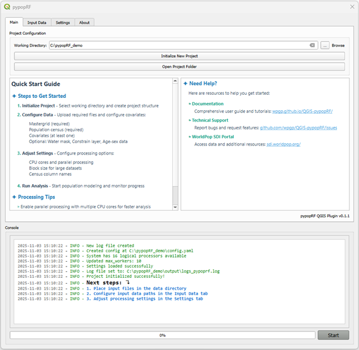
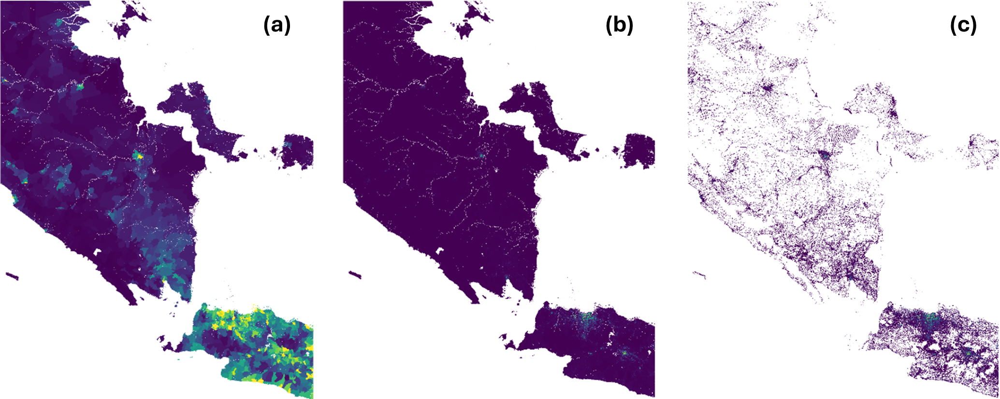

# Summary

Accurate data on the spatial distribution of population is an essential source of information to a wide range of environmental, health and sustainable developmental applications. Consequently, there has been considerable work to develop modelled gridded datasets that accurately capture population distributions at subnational scales. However, generating these datasets generally demands specialised expertise of statistical modelling approaches and computational programming methods. To overcome these challenges, the Spatial Data Infrastructure (SDI) Team at WorldPop have developed the QGIS pypopRF Plugin, a high-resolution population mapping tool that uses machine learning and dasymetric techniques within open-source GIS software [@QGIS_2025]. The QGIS pypopRF Plugin transforms input data into detailed gridded population distribution maps using a random forest (RF) dasymetric modelling approach [@Stevens_2015] that combines census data, building information and various spatial constraints. The core computational functionality of the plugin is provided by the pypopRF Python package; however, to enable non-technical users without programming expertise, the QGIS pypopRF Plugin offers a suite of tools within a graphical interface to facilitate the implementation of top-down population disaggregation methods [@Wardrop_2018]. Users can easily adjust input data and settings within a customisable interface. Population modelling can be computationally intensive, therefore the plugin has been developed to subdivide work among multiple subtasks for parallel processing. This paper aims to describe the core functionality and features of the QGIS pypopRF Plugin, and how the plugin can be leveraged to create high-resolution gridded population data.

# Statement of need

Globally, population dynamics display considerable variation across local-regional scales due to the interface of a series of phenomena. Notable amongst these phenomena are demographic trends [@OECD_2024], urbanisation [@Sun_2020], and migration patterns [@Qiao_2024] which shape human population distribution and change in distinct ways across countries and regions. In this setting, subnational population datasets are essential to capturing these dynamics and therefore a swathe of applications, including public health strategy, disaster risk management, urban planning and resource allocation [@Maneepong_2025; @Wardrop_2018]. 

However, generating gridded population typically requires expertise in statistical methods and programming skills [@Leyk_2019; @Tatem_2007]. In-fact tools that precede this plugin, pypopRF [@Priyatikanto_2025] and popRF for R [@Bondarenko_2021], are primarily operable at a command-line or scripting level, thereby limiting the accessibility of these methods from a wider community. Therefore, open-source and replicable tools for population modelling are crucial to bridging the gap between data curators and data users [@Mobasheri_2020].

To address these challenges, the QGIS pypopRF plugin seeks to provide an integrated tool that is accessible to a broad range of users, including GIS practitioners, analysts and educators/students. The Plugin embeds the pypopRF package [@Priyatikanto_2025] functionality directly into QGIS, providing a single accessible environment for parameter control, model execution and output visualisation. The plugin facilitates a consistent, reproducible workflow for gridded population data creation with detailed logging options. This enhances the transparency of methods, enabling users to document and share model configurations as well as outputs.

# Overview of the QGIS pypopRF Plugin Functionality

The QGIS pypopRF plugin provides a user-friendly interface to the underlying pypopRF Python library \autoref{fig:user_interface}, enabling users to generate high-resolution population distribution maps using machine learning and dasymetric mapping techniques.

## Project Initialisation & Configuration

The user begins a new project within the “Main” tab of the plugin window, by specifying the address path that the working directory should be configured within. A new project structure  including the output directory and a log file will be created at this address path location

The user can flexibly browse to and select input data for analysis via the “Input Data” tab. The plugin differentiates between datasets that are (i) required or (ii) optional to data analysis (Table 1). A raster file that defines zones using unique IDs, referred to here as a “mastergrid”, must be used to delineate census boundaries. Population count data must be supplied as a CSV file, with unique zone IDs that align with the mastergrid zone IDs. Optionally, additional attributes such as age-sex counts may be included in the CSV file. At least one covariate must be added to train the model. This is any geospatial variable that is related to human population distribution such as building location, infrastructure or elevation. Optional inputs allow users to refine the prediction areas to exclude uninhabited areas according to a mask (e.g. water bodies) or to constrain population disaggregation to specific areas (e.g. human settlement footprint).

Table 1. Summary of input data parameters.

| Data file                                       | Format   | Dependency |
|-------------------------------------------------|----------|------------|
| Mastergrid raster defining analysis zones       | GeoTIFF  | Required   |
| Census data with population counts              | CSV      | Required   |
| Geospatial covariate rasters (e.g. landcover, infrastructure) | GeoTIFF | Required |
| Water mask for excluding water bodies           | GeoTIFF  | Optional   |
| Constraint raster to specify areas (e.g. human settlement) | GeoTIFF | Optional |
| Age-sex population structure data               | CSV      | Optional   |

## Settings Configuration

Processing parameters and analysis options can be customised in the “Settings” tab. The plugin provides several options to improve computation performance when processing large datasets. Notably, computation can be parallelised across a user-specified number of CPU cores, whilst large datasets can be processed in smaller, adjustable blocks to improve memory-efficiency.

## Analysis and Interface

The plugin uses a Random Forest model [@Stevens_2015] to perform this analysis; a gridded population density weighting layer at the target resolution is created and implemented for dasymetric disaggregation of population counts from census zones into target grid cells as supplied by the mastergrid. The model is trained at administrative unit level using the set of covariates specified by the user.

At its core, the plugin leverages the rasterio library [@Gillies_2019] for seamless raster input and output operations, ensuring efficient handling of geospatial covariates. For data computation in a vector format, pandas [@pandas_2020] and its spatial extension, geopandas [@Jordahl_2020], enable powerful data manipulation and analysis, particularly with vector data that might be associated with the raster information. To optimise performance and manage the workflow efficiently, joblib [@Joblib_2025] is integrated for pipelining and parallel processing, which significantly speeds up computation by utilizing multi-core processors. Finally, the foundational machine learning capabilities within pypopRF are powered by the extensive algorithms and tools provided by the scikit-learn (sklearn) library [@Pedregossa_2011], allowing for the construction and application of sophisticated models.
Population can be redistributed more realistically by using masks and constraints. A mask, for example an inland water mask, can be used to prevent population prediction in areas identified as inland water. Moreover, when a constraint is provided, such as human settlement footprint, the model is instructed to create a layer in which population estimation is only within areas mapped as containing built settlements, rather than across all land grid cells.

Analysis can be monitored in the interface by inspecting the percentage progress bar and the console area. The console also displays error messages, status updates and important notifications supporting the user with real-time feedback. This feedback can be applied via a Start / Stop button to control processing. A completion message will be displayed in the console area once the analysis has concluded.

## Outputs

Completion of the analysis generates several output rasters, capturing different levels of analysis \autoref{fig:outputs}.

When age-sex population data has been supplied, additional outputs detailing population distribution of age-sex categories will be generated in the “…/agesex/” directory. Moreover, several files are created capturing different aspects of the analysis, including detailed processing logs, feature scalers and importance scores of predictor variables. The latter enables the user to assess the most influential covariates to the model. 

# Acknowledgements

This work was supported by funds from the Gates Foundation (INV-045237 and INV-088965) and Wellcome Trust (308679/Z/23/Z). This work forms part of the outputs of WorldPop (www.worldpop.org). The funders had no role in study design, data collection and analysis, decision to publish, or preparation of the manuscript.

# References
