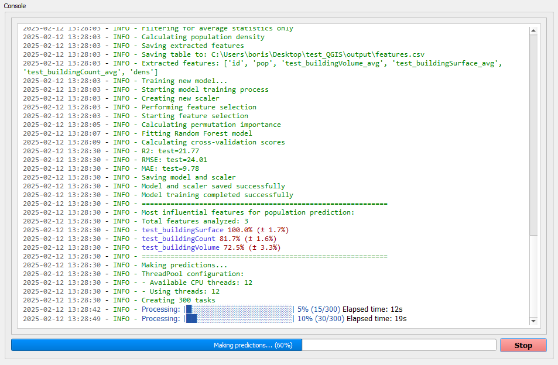

# QGIS pypopRF Plugin Documentation

  

## Quick Navigation
- [About pypopRF](#about-pyPoprf)
- [How It Works](#how-it-works)
- [Plugin Interface](#plugin-interface)
- [Analysis Results](#analysis-results)
- [Quick Start](getting-started/quickstart.md)

## About pypopRF

pypopRF is a powerful tool developed by the WorldPop SDI Team that transforms your input data into detailed population distribution maps. It combines census data, building information, and machine learning to create accurate population estimates.

💡 Technical Foundation: The plugin is built on the [pypopRF Python package](https://github.com/wpgp/pypopRF), which provides the core computational functionality. While the plugin makes these tools accessible through a graphical interface, advanced users can also use the Python package directly for more customized workflows.

⚠️ Note: For advanced features and detailed technical documentation of the underlying algorithms, please refer to the [pypopRF documentation](https://wpgp.github.io/pypopRF/).

## How It Works

## Plugin Interface

  
   
  <em>Main plugin interface</em>

### Key Components:

1. **Project Tab**: Initialize your project and manage settings
2. **Input Data Tab**: Configure all required data files
3. **Settings Tab**: Adjust processing parameters
4. **Console**: Monitor progress and view logs
5. **Control Panel**: Start/stop analysis and view progress

💡 **Tip:** Use the tabs to navigate through the workflow in a logical sequence.

## Analysis Results

The plugin generates three key outputs that show the progression of the analysis:

  

    

      
      
<strong>1. Population Prediction</strong> 
      Initial probability surface showing likely population distribution

    

    

      
      
<strong>2. Normalized Census</strong> 
      Population values adjusted to match census totals

    

    

      
      
<strong>3. Final Distribution</strong> 
      High-resolution population distribution map

    

  

## Processing in Action

  
   
  <em>Real-time processing feedback and progress monitoring</em>

## Key Features

✅ **User-Friendly Interface**

- Visual data management
- Intuitive configuration
- Real-time progress tracking
- Direct QGIS integration

⚠️ **Important Considerations**

- Ensure consistent coordinate systems
- Verify input data quality
- Monitor system resources
- Back up project files

## Support and Resources

- 🐛 **Report Issues**: [GitHub Issues](https://github.com/wpgp/QGIS-pypopRF/issues)
- 📧 **Get Help**: Contact [WorldPop SDI Team](https://sdi.worldpop.org)
- 📚 **Documentation**: Continue reading guides below
- 🆕 **Updates**: Check [GitHub Releases](https://github.com/wpgp/QGIS-pypopRF/releases)

## About WorldPop SDI

The WorldPop Spatial Data Infrastructure (SDI) Team at the University of Southampton specializes in:

- Population mapping
- Spatial demographics
- Open-source geospatial tools
- Machine learning for population estimation

## License

The QGIS pypopRF plugin is released under the MIT License. See the [LICENSE](https://github.com/wpgp/QGIS-pypopRF/blob/main/LICENSE) file for details.

---

  <a href="#top">↑ Back to Top</a>

*Next Steps:*
- [Installation Guide](getting-started/installation.md)
- [Quick Start Guide](getting-started/quickstart.md)
- [User Interface Guide](user-guide/interface.md)