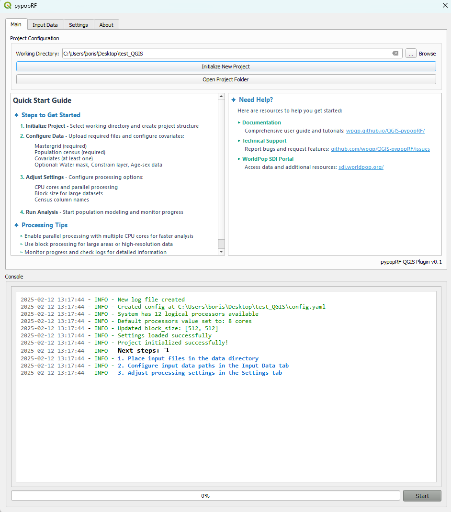

# QGIS pypopRF Plugin Documentation  
  

  
    

  
  
## Quick Navigation  
- [About pypopRF](#about-pyPoprf)  
- [Key Features](#key-features)  
- [How It Works](#how-it-works)  
- [Plugin Interface](#plugin-interface)  
- [Analysis Results](#analysis-results)  
- [Quick Start](getting-started/quickstart.md)  
  
## About pypopRF  
  
pypopRF is a comprehensive population mapping tool developed by the WorldPop SDI Team. It transforms your input data into detailed population distribution maps using advanced machine learning techniques. The plugin combines census data, building information, and various spatial constraints to create highly accurate population estimates.  
  
💡 **Technical Foundation**: The plugin is built on the [pypopRF Python package](https://github.com/wpgp/pypopRF), which provides the core computational functionality. While the plugin makes these tools accessible through a graphical interface, advanced users can also use the Python package directly for more customized workflows.  
  
⚠️ **Note**: For advanced features and detailed technical documentation of the underlying algorithms, please refer to the [pypopRF documentation](https://wpgp.github.io/pypopRF/).  
  
## Key Features  
  
### Core Functionality  
- 🗺️ High-resolution population distribution mapping  
- 🤖 Machine learning-based prediction using Random Forest  
- 📊 Advanced dasymetric mapping techniques  
- 📈 Comprehensive statistical analysis  
  
### Advanced Features  
- 👥 Age and sex structure mapping  
- 💧 Water mask integration  
- 🏗️ Building footprint constraints  
- 🚀 Parallel processing support  
- 📋 Real-time progress monitoring  
- 🎯 Customizable processing parameters  
  
## How It Works  
  

  
## Plugin Interface  
  

  
    
     
  <em>Main plugin interface with enhanced features</em>  

  
  
### Key Components:  
  
**Project Tab**: Initialize project and manage settings  
  
**Input Data Tab**: Configure required and optional data files:  
  
- Census data (required)  
- Mastergrid (required)  
- Covariates (required)  
- Water mask (optional)  
- Constraints (optional)  
- Age-sex structure data (optional)  
  
**Settings Tab**: Adjust processing parameters:  
  
- Parallel processing options  
- Block processing settings  
- Census field mappings  
- Output preferences  
  
**Console**: Monitor progress and view detailed logs  
  
**Control Panel**: Start/stop analysis and track progress  
  
## Analysis Results  
  
The plugin generates multiple output layers showing different aspects of the analysis:  
  

  
  
  
    
  
        
      
<strong>1. Normalized Census</strong>   
      Census-adjusted values
  
    
  
    
  
        
      
<strong>2. Unconstrained Population</strong>   
      Basic population distribution
  
    
  
    
  
        
      
<strong>3. Constrained Population</strong>   
      Distribution with spatial constraints
  
    
  
  
  

  
  
### Additional Outputs  
  
- 📊 **Age-Sex Structure Maps**: When age-sex data is provided  
- 📈 **Feature Importance**: Analysis of predictor variables  
- 📝 **Processing Logs**: Detailed analysis records  
- 🤖 **Model Files**: Saved for future use  
  
## Processing Features  
  
✅ **Enhanced Processing**  
  
- Multi-threaded computation  
- Block-based processing for large datasets  
- Progress tracking for each step  
- Memory-efficient operations  
- Robust error handling  
  
⚠️ **Important Considerations**  
  
- Ensure consistent coordinate systems across all inputs  
- Verify data quality and completeness  
- Monitor system resources during processing  
- Regularly backup project files  
- Consider memory requirements for large datasets  
  
## Support and Resources  
  
- 🐛 **Report Issues**: [GitHub Issues](https://github.com/wpgp/QGIS-pypopRF/issues)  
- 📧 **Get Help**: Contact [WorldPop SDI Team](https://sdi.worldpop.org)  
- 📚 **Documentation**: Continue reading guides below  
- 🆕 **Updates**: Check [GitHub Releases](https://github.com/wpgp/QGIS-pypopRF/releases)  
  
## About WorldPop SDI  
  
The WorldPop Spatial Data Infrastructure (SDI) Team at the University of Southampton specializes in:  
  
- High-resolution population mapping  
- Spatial demographics  
- Open-source geospatial tools  
- Machine learning for population estimation  
- Demographic data integration  
  
## License  
  
The QGIS pypopRF plugin is released under the MIT License. See the [LICENSE](https://github.com/wpgp/QGIS-pypopRF/blob/main/LICENSE) file for details.  
  
---  
  

  
  <a href="#top">↑ Back to Top</a>  

  
  
*Next Steps:*  
- [Installation Guide](getting-started/installation.md)  
- [Quick Start Guide](getting-started/quickstart.md)  
- [User Interface Guide](user-guide/interface.md)